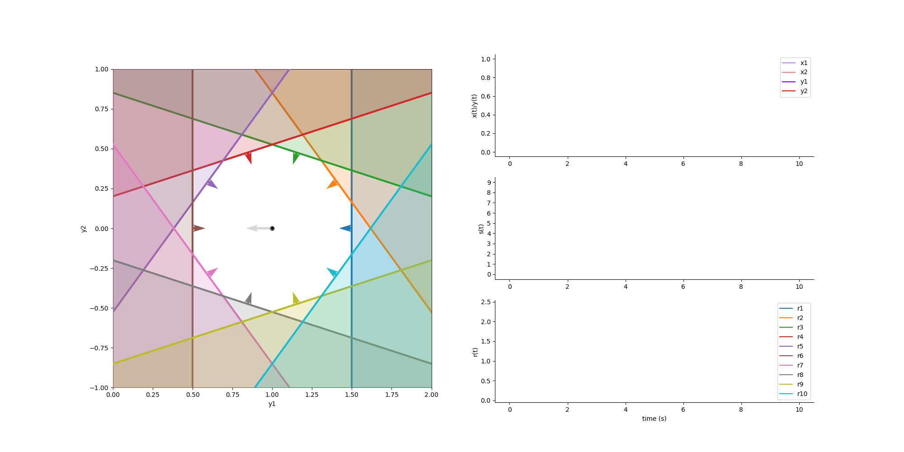

***********
Autoencoder
***********

.. role:: python(code)
   :language: python

.. Blabla

.. code-block:: python
    :caption: Autoencoder example
    :name: Autoencoder example

    import numpy as np

    from SCN import Autoencoder, Simulation

    # Example network
    net = Autoencoder.init_2D_spaced(N=10, spike_scale=0.4)

    # Construct input
    x1 = np.tile([[-1], [0]], (1, 2000))
    x2 = np.array(
    [
        -np.cos(np.linspace(0, np.pi / 2, 8000)),
        np.sin(np.linspace(0, np.pi / 2, 8000)),
    ]
    )
    x = np.hstack([x1, x2])

    # Run simulation
    sim = Simulation()
    sim.run(net, x)

    # Animate the simulation
    sim.animate()

