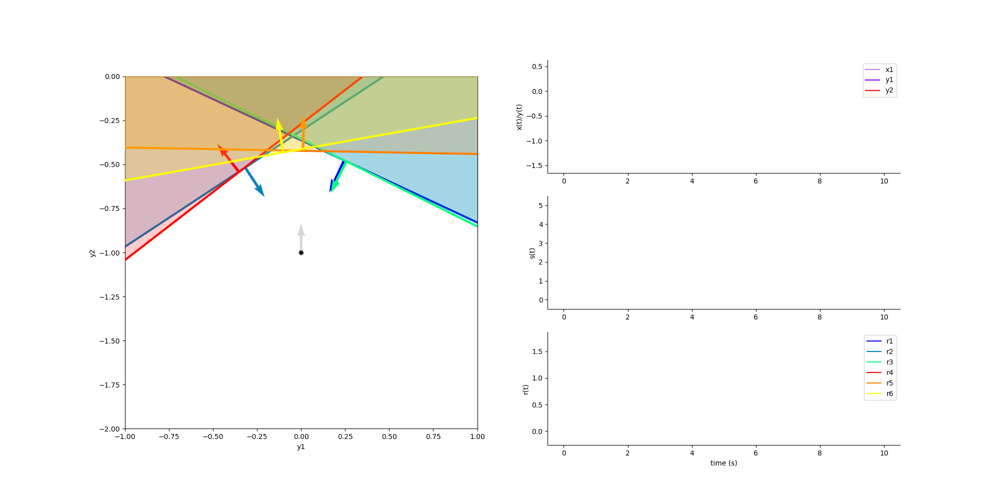

***********
E/I Network
***********

.. role:: python(code)
   :language: python

.. Blabla

.. code-block:: python
    :caption: EI Network example
    :name: EI Network example

    import numpy as np

    from SCN import EI_Network, Simulation

    # Example network
    net = EI_Network.init_2D_random(di=1, NE=3, NI=3, seed=5, Fseed=0)

    # Construct input
    x1 = np.zeros(2000)
    x2 = np.linspace(0, 0.5, 8000)
    x = np.hstack([x1, x2])

    # Run simulation
    sim = Simulation()
    sim.run(net, x, draw_break="one", criterion="inh_max", y0=np.array([0, -1]))

    # Animate the simulation
    sim.animate()

