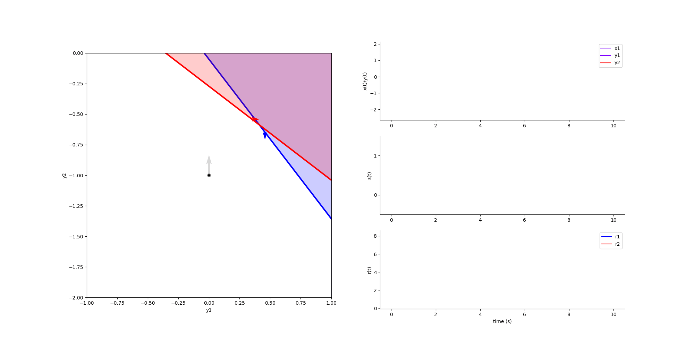

***********
2 Neurons
***********

.. role:: python(code)
   :language: python

.. Blabla

.. code-block:: python
    :caption: 2 Neurons example
    :name: 2 Neurons example

    import numpy as np

    from SCN import EI_Network, Simulation

    # Example network
    net = EI_Network.init_2D_spaced(
        di=1,
        NE=1,
        NI=1,
        Fseed=0,
        angle_range=[np.pi / 8, 3 * np.pi / 8],
        latent_sep=np.eye(2),
        spike_scale=0.5,
    )

    # Construct input
    x1 = np.zeros(2000)
    x2 = np.linspace(0, 0.5, 8000)
    x = np.hstack([x1, x2])

    # Run simulation
    sim = Simulation()
    sim.run(net, x, draw_break="one", criterion="inh_max", y0=np.array([0, -1]))

    # Animate the simulation
    sim.animate(rate_space=False)

