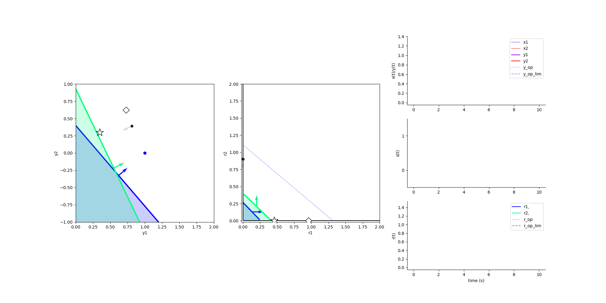

*************************
Constrained optimization
*************************

.. role:: python(code)
   :language: python

.. Blabla

.. code-block:: python
    :caption: Constrained optimization example
    :name: Constrained optimization example

    import numpy as np

    from SCN import Autoencoder, Simulation, transform

    # Example network
    net = Autoencoder.init_2D_random(N=2, angle_range=[-np.pi / 2, -np.pi], seed=0)

    # Construct input
    x = transform.angle_encode(np.linspace(0, 1, 10000))

    # Run simulation
    sim = Simulation()
    sim.run(net, x)

    # Solve constrained optimization
    sim.optimize(net, x)

    # Animate the simulation
    sim.animate()

