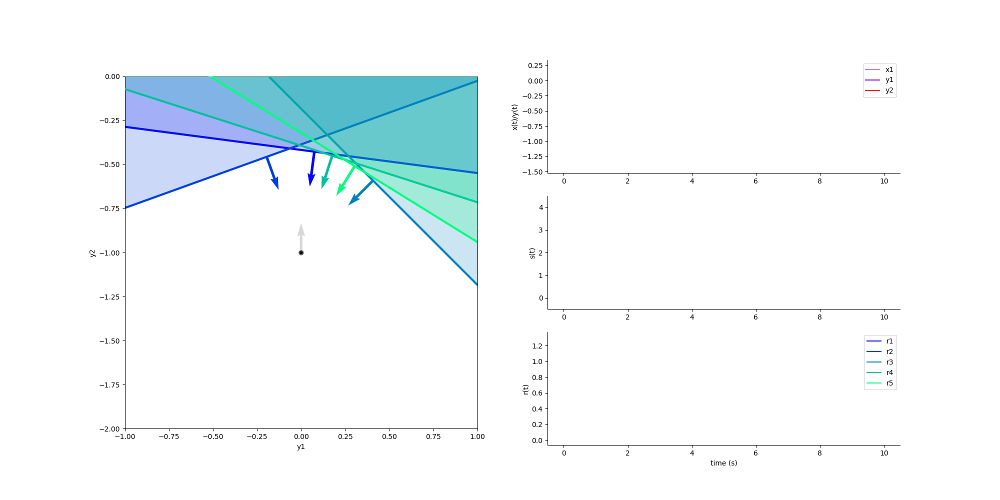
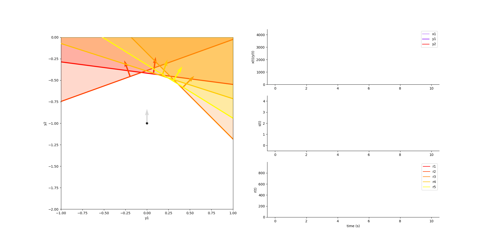

**************************
Single Population (E or I)
**************************

.. role:: python(code)
   :language: python

.. Blabla

.. code-block:: python
    :caption: Single Population example
    :name: Single Population example

    import numpy as np

    from SCN import EI_Network, Simulation

    # Example network
    net = EI_Network.init_2D_random(di=1, NI=5, seed=1)

    # Construct input
    x1 = np.zeros(2000)
    x2 = np.linspace(0, 0.2, 8000)
    x = np.hstack([x1, x2])

    # Run simulation
    sim = Simulation()
    sim.run(net, x, y0=np.array([0, -1]))

    # Animate the simulation
    sim.animate()

You can also do the same with an all excitatory population. However, since
there is no inhibition, the network will simply explode!

.. code-block:: python
    :caption: Single Population E example
    :name: Single Population E example

    net = EI_Network.init_2D_random(di=1, NE=5, seed=1)

